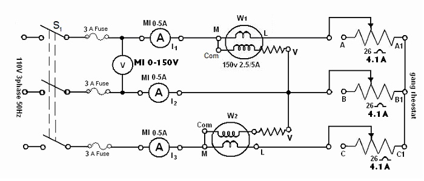
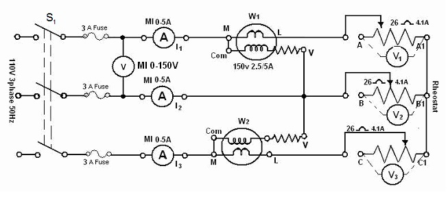

### Procedure

<strong>BALANCED LOAD :</strong>

							

                                	
							
Fig. 1. Three phase power measurement circuit under balance condition

							 
							&nbsp;
							<ol>
								<li>Connect the circuit as shown in Fig. 1.</li>
								<li>Adjust the ganged rheostat for the maximum resistance.</li>
								<li>Switch on the supply.</li>
								<li>Close switch S1.</li>
								<li>Read the meters to obtain VL, I1, I2 and I3. Note the wattmeter reading W1 and W2`(Note the multiplying factor on the wattmeter).</li>
								<li>Vary the load resistance and obtain at least five sets of observations, the current should not exceed the limit (4.1 A).</li>
							 
							&nbsp;
							
<strong>UNBALANCED LOAD :</strong>

							

                                
							
Fig. 2. &nbsp; Three phase power measurement circuit under unbalance condition

							 
							&nbsp;
							<ol>
								<li>Connect the circuit as shown in Fig. 2.</li>
								<li>Replace the ganged rheostat by three separate rheostats of 26 Ω, 4.1 A and connect in a star.</li>
								<li>Adjust the three rheostats at the maximum values.</li>
								<li>Switch on the supply and set the autotransformer to 110 V.</li>
								<li> Close switch S1 and take five sets of observation for different rheostat settings such that the reading of I1, I2 and I3 in each set is appreciably different to create unbalanced loading condition. The current should not exceed the limits in each arm.</li>
							</ol>
							 
							 
							 
							 
	
